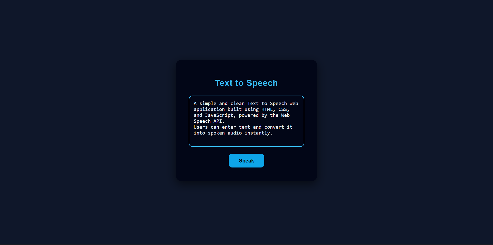

# Text to Speech

A simple **Text to Speech** web application built using **HTML, CSS, and JavaScript**.  
It uses the browser’s built-in **Web Speech API** to convert user input text into spoken audio.


## 📌 Overview

This project allows users to enter text in a textarea and convert it into speech by clicking a button.  
It focuses on clean UI design, basic DOM manipulation, and working with a built-in browser API.


## 🛠️ Technologies Used

- HTML
- CSS
- JavaScript
- Web Speech API


## ⚙️ How It Works

- User enters text in the input box  
- Clicks the **Speak** button  
- JavaScript captures the text  
- Browser converts text into speech  


## 📂 Project Structure

├── index.html
├── style.css
└── script.js


## ✨ Features

- Converts text input into speech
- Uses browser built-in Web Speech API
- Clean and modern UI
- No external libraries required
- Basic input validation


## 🚀 Getting Started

1. Clone the repository  
   ```bash
   git clone https://github.com/dinishsg/text-to-speech-js.git
2. Open index.html in your browser.
3. Enter text and click **Speak**.


## 📸 Screenshots




## 🌐 Live Demo

🔗(https://dinishsg.github.io/text-to-speech-js/)
